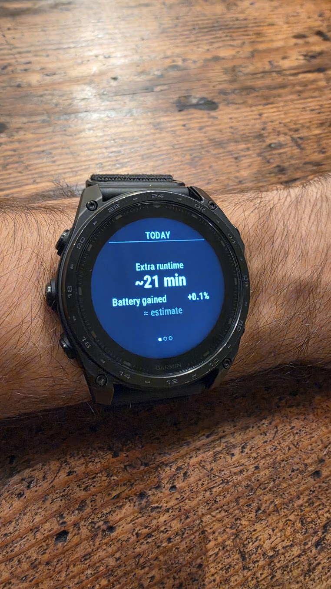
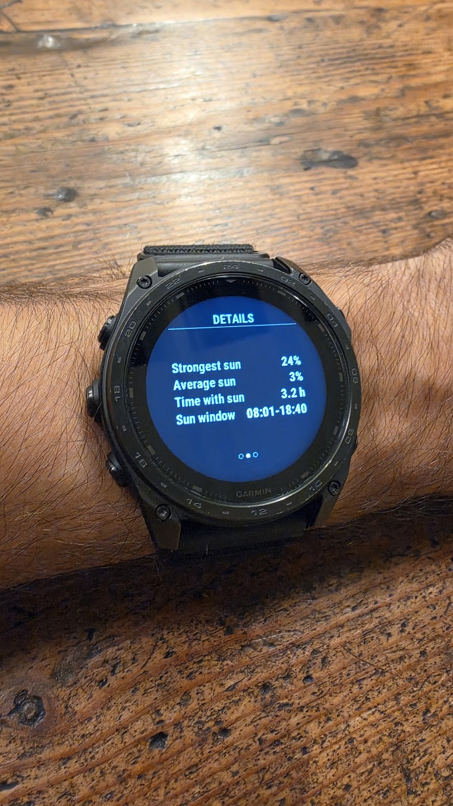
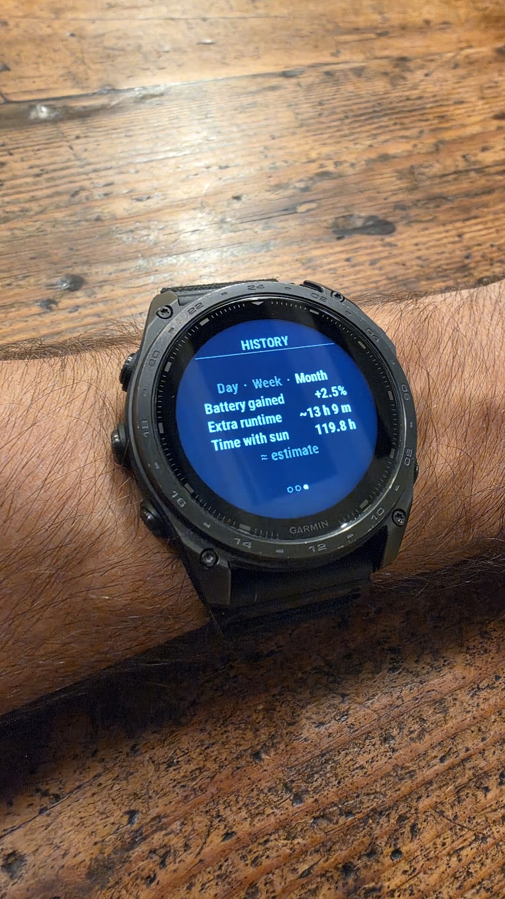

# Solar Truth

**Your sunlight. Your battery.**

Solar Truth is a Garmin Connect IQ device app that connects solar exposure with estimated battery benefit and extra runtime. It began with a simple question: what does the solar intensity graph mean for everyday battery life?

Version: **9.2** · Created by Davide La Sala.

## What it shows

- **TODAY:** estimated battery benefit and extra runtime.
- **DETAILS:** strongest solar reading, average positive intensity, time with sunlight, and first/last light readings.
- **HISTORY:** day, week and month summaries, retaining up to 31 daily records.
- **Diagnostics:** version/build information, calibration status and optional backup/export actions.

Background sampling runs approximately every five minutes. New installations start with their own readings, without demonstration history. Allow at least two samples for daily estimates.

## Screenshots

Actual watch photographs, with metadata removed.

| TODAY | DETAILS | HISTORY |
|---|---|---|
|  |  |  |

## Supported devices

The project targets `fenix8solar51mm`: fēnix 8 Solar 51 mm and tactix 8 Solar 51 mm. Physical testing has been performed on tactix 8 Solar 51 mm. Other products are not currently included in the manifest.

## Understanding the estimates

Solar intensity is an exposure proxy, not harvested watts. Solar Truth combines an exposure model with battery-drain calibration when enough suitable data is available. Cable charging is tracked separately. Activity, settings, varying power use and battery-gauge quantisation can affect the results. Displayed battery benefit and runtime are estimates, not measurements of electrical energy.

## Build

Install Garmin Connect IQ SDK 9.2.0, the Monkey C extension and the `fenix8solar51mm` device pack. Create your own developer signing key using the Monkey C extension and keep it outside this repository.

From the repository root, with the SDK's `bin` directory on PATH:

```powershell
monkeyc -f monkey.jungle -d fenix8solar51mm -r -o bin/SolarTruth.prg -y C:/keys/developer_key.der
```

Create `bin` first. Alternatively use:

```powershell
./scripts/build.ps1 -SdkBin C:/path/to/connectiq-sdk/bin -DeveloperKey C:/keys/developer_key.der
```

For a store package:

```powershell
./scripts/build.ps1 -SdkBin C:/path/to/connectiq-sdk/bin -DeveloperKey C:/keys/developer_key.der -Export
```

The official publisher key is intentionally excluded. Your own key will not reproduce the official signed package. If publishing a separate fork, assign it a new app ID; retain your own signing key for later updates.

## Tests

```powershell
./scripts/build.ps1 -SdkBin C:/path/to/connectiq-sdk/bin -DeveloperKey C:/keys/developer_key.der -Test
```

This compiles and runs the Monkey C stability tests in the simulator. Start the Connect IQ simulator first. Tests cover empty startup and startup with a full 288-sample buffer, 31 days of rollups and negative night readings.

## Controls

- UP/DOWN: change view.
- START on HISTORY: cycle day/week/month.
- START on other views: sample and refresh.
- MENU: diagnostics/actions; MENU again switches diagnostics.
- BACK: return or exit.

## Privacy

Normal operation requires no account or internet connection. Samples, daily rollups and calibration are stored locally on the watch. Optional diagnostic backups contain timestamped solar and battery readings. FIT exports may enter Garmin activity files and sync through Garmin services. Review logs before attaching them to public issues. See [privacy policy](docs/privacy.html).

## Validation status

The stability tests passed on the release-candidate source before the display version was changed to 9.2. On 6 October 2026, the owner reported that the installed v9.1 still reopened late in the evening after the startup fix. The 9.2 package passed local Garmin SDK signature verification. The 9.2 build has not yet been validated on the physical watch; reopening after the next day change remains a follow-up check. GitHub publication does not imply Connect IQ Store approval.

## Project layout

`source/` contains Monkey C modules; `resources/` contains strings and the launcher icon; `manifest.xml` and `monkey.jungle` define the app; `scripts/build.ps1` builds, exports or tests it.

Report issues with watch model, firmware, app version and reproduction steps. Include only diagnostics you intend to make public.

## Copyright

Copyright © 2026 Davide La Sala. No redistribution license has been granted yet. Garmin trademarks belong to their owners. This is an independent project, not affiliated with or endorsed by Garmin.
