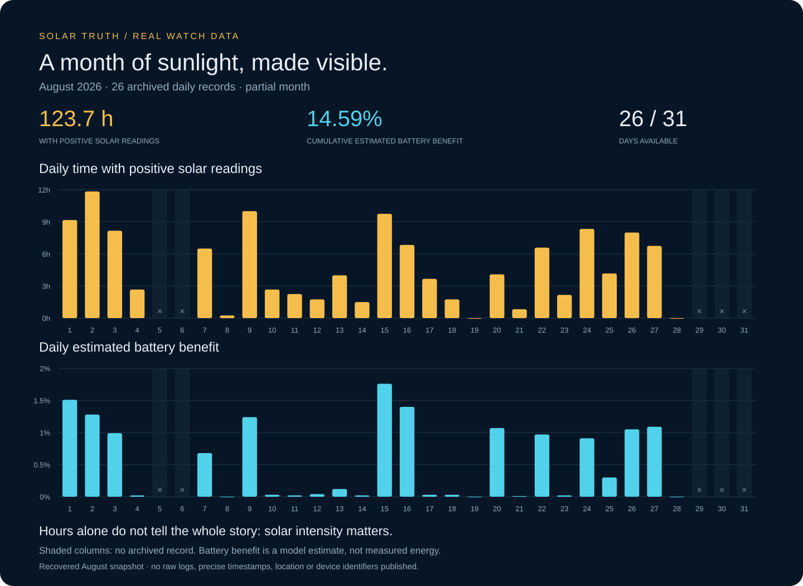

# August 2026: archived solar readings

The recovered snapshot contains **26 daily records**, totalling **123.72 hours with positive solar readings** and **14.59 percentage points of cumulative estimated battery benefit**. Days 5, 6, 29, 30 and 31 have no archived daily record and are shown as missing, not zero. This is not a complete monthly total.

The top panel plots archived `sun` hours; the bottom plots the archived recomputed `est%` value, using one historical calibration snapshot consistently. Estimates differ from the `sto%` values originally stored on individual days. Values were rounded by the app before logging. These historical estimates were produced by an earlier app version, not freshly measured with 9.2.

Positive solar-reading time includes weak light. Eight hours with positive readings is not equivalent to eight hours of full-intensity exposure. This archive does not contain a reliable daily full-battery-runtime value, so no hours-of-runtime conversion or 1:1 claim is made.

Only the aggregate chart is published. Raw logs, precise first/last-light timestamps, battery history, device identifiers and location data are excluded.
